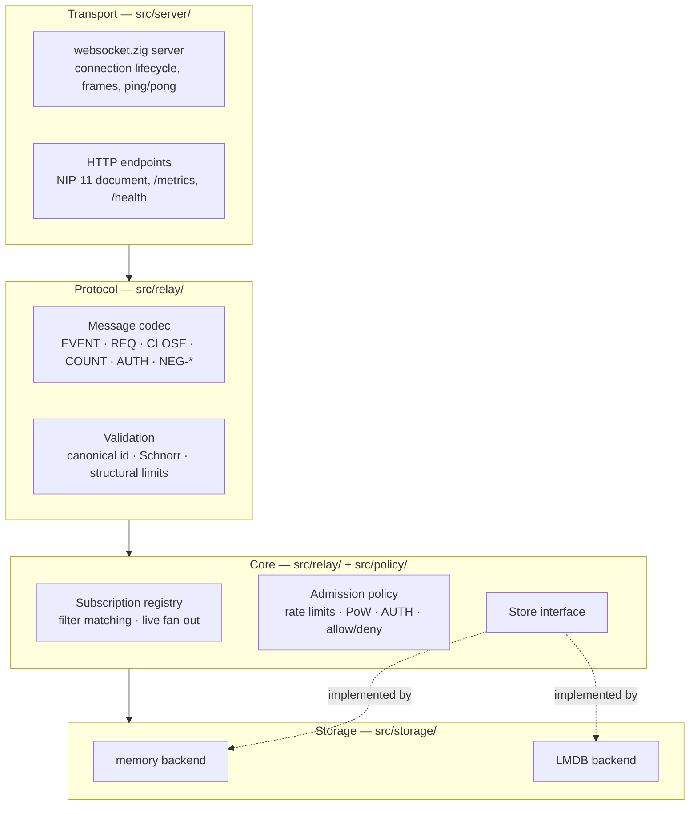
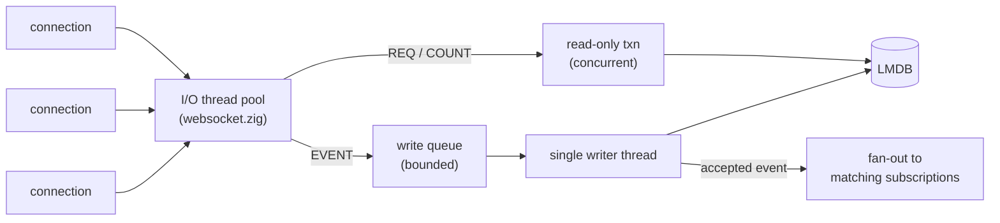

# Architecture

This document describes the target architecture. It is written in the present tense; the
[roadmap](roadmap.md) states which parts exist yet.

## Layers

easyrelay is organised into four layers with one-directional dependencies. Each layer may call
the layer below it and never the layer above.



### Transport

Owns sockets and nothing else. Built on
[`websocket.zig`](https://github.com/karlseguin/websocket.zig), whose Zig 0.16 support is
upstream-flagged as experimental — see [ADR-0004](adr/0004-websocket-transport.md).

One connection maps to one handler instance. `websocket.zig` guarantees that a single
connection's messages are processed one at a time, which removes the need for per-connection
locking in the layers above. This layer enforces the frame-level limits (maximum message size,
maximum in-flight write buffer), answers ping with pong, and closes connections that exceed
their write backlog rather than buffering without bound.

The same listener serves the plain HTTP surface: the NIP-11 relay information document when the
request carries `Accept: application/nostr+json`, `GET /metrics`, and `GET /health`.

### Protocol

Decodes and encodes the Nostr wire format, and validates events. Message parsing, filter
representation and event structure come from `zig-nostr/nostr`'s `message.zig`, `filter.zig`
and `event.zig`; this layer adapts them to the relay's needs rather than reimplementing them.

Validation of an inbound event, in order and short-circuiting on first failure:

1. Structural limits — serialized size, tag count, tag element length, content length.
2. `created_at` window — reject too far in the past or the future.
3. Canonical id — recompute SHA-256 over `[0,pubkey,created_at,kind,tags,content]` and compare.
4. Signature — BIP-340 Schnorr verification against `pubkey`.

Cheap checks precede expensive ones deliberately: signature verification is the costly step and
must not be reachable by an unauthenticated client sending malformed input. The exact rules are
specified in [protocol.md](protocol.md).

### Core

Holds the relay's actual logic.

The **subscription registry** maps each connection to its open subscriptions and each
subscription to its filter set. It answers two questions: what stored events satisfy a new
`REQ` (delegated to the store), and which open subscriptions match an event that just arrived
(evaluated in memory). The second is the hot path — every accepted event is tested against
every active filter — and is the first place to look when connection counts grow.

The **admission policy** decides whether an event is accepted at all: rate limits per connection
and per pubkey, minimum proof-of-work, NIP-42 authentication requirements, NIP-70 protected
events, and operator allow/deny lists by pubkey and by kind. Policy runs after validation and
before the store. Rejections return a machine-readable `OK` prefix.

The **`Store` interface** is easyrelay's own abstraction, not a re-export of a dependency's
type. See [ADR-0008](adr/0008-store-abstraction-boundary.md) for why this boundary is
load-bearing.

```zig
// Shape only; the real signatures are settled in Phase 1.
pub const Store = struct {
    put: fn (event: Event) StoreError!PutResult,       // handles kind semantics
    putBatch: fn (events: []const Event) StoreError![]PutResult, // one transaction
    query: fn (filters: []const Filter, out: *Sink) StoreError!void,
    count: fn (filters: []const Filter) StoreError!u64,
    delete: fn (target: EventId, by: PubKey) StoreError!bool,
    expire: fn (now: i64) StoreError!usize,            // NIP-40 reaper
};
```

`putBatch` is not an optimisation to add later. The
[Phase 0 spike](research/2026-08-phase-0-validation.md#q4--the-write-transaction-boundary-no-and-this-is-the-important-one)
measured one durable transaction per event at 92 events/s against 169,491 events/s for a single
batched transaction — a factor of 1,842, entirely `fsync` per commit. The writer thread drains
its queue in batches for that reason, and the interface has to admit it.

`query` takes a *list* of filters because a NIP-01 `REQ` carries several, OR-ed, and the
subscription's `limit` applies across the merged result rather than per filter. Getting that
wrong returns plausible but incorrect events.

### Storage

Two implementations behind that interface:

- **`memory`** — a hash map plus a sorted index. Exists for tests and for Phase 1. It is not a
  deployment option and is not tuned.
- **`lmdb`** — the real backend, backed by `zig-nostr/nostr`'s zero-copy LMDB store. The data
  model and index design are in [storage.md](storage.md).

## Concurrency model

**A pool of I/O threads, and exactly one writer thread.**

LMDB permits many concurrent readers but only one write transaction at a time; the write lock is
process-wide. Serialising writes through a single owner thread is therefore not a simplification
to be removed later — it is what the storage engine asks for. strfry makes the same choice.



Consequences that shape the rest of the design:

- **Reads do not block.** A `REQ` opens a read-only transaction on the calling I/O thread and
  streams results directly to the socket. Read transactions are cheap and never wait on the
  writer.
- **The write queue is bounded.** When it fills, new events are rejected with a `rate-limited:`
  `OK` rather than queued. Backpressure is visible to the client, not absorbed silently.
- **Fan-out happens after the write commits**, on the writer thread, so a subscriber never
  receives an event that a subsequent read would fail to find.
- **Long-lived read transactions pin old pages.** A slow subscriber draining a large `REQ` keeps
  a read transaction open and prevents LMDB from reclaiming pages, which grows the file. Query
  results are therefore bounded and streamed with a cap, never materialised in full.

Moving from the thread pool to an evented runtime is Phase 6 work and is deliberately deferred;
the reasoning is in [ADR-0005](adr/0005-concurrency-model.md).

## Data flow

**Publishing.** `EVENT` arrives → protocol layer validates → policy layer admits → enqueued to
the writer → writer applies kind semantics and commits → `OK` returned to the publisher →
event fanned out to every matching open subscription.

**Subscribing.** `REQ` arrives → filters parsed and bounds-checked → subscription registered →
stored events streamed newest-first up to `limit` → `EOSE` → the subscription stays open and
receives live events until `CLOSE`, or until the relay sends `CLOSED`.

Ephemeral kinds skip the writer entirely: they are validated, admitted, fanned out and dropped.

## Repository layout

```
build.zig
build.zig.zon
.zigversion
src/
  main.zig            entry point, startup, signal handling
  config.zig          configuration loading and validation
  server/             transport: websocket handlers, HTTP endpoints
  relay/              protocol codec, validation, subscription registry
  policy/             rate limiting, PoW, auth, allow/deny lists
  storage/
    store.zig         the Store interface
    memory.zig        in-memory backend
    lmdb.zig          LMDB backend
  nips/               nip11.zig, nip42.zig, nip45.zig, nip50.zig, nip77.zig, nip86.zig
  metrics/            Prometheus registry and exposition
tests/
  conformance/        protocol rules from docs/protocol.md
  vectors/            official test vectors
bench/                benchmark harness
```

## Decision index

Every architectural claim above traces to a record:

| Topic | Record |
| --- | --- |
| Zig 0.16.0, pinned toolchain | [ADR-0001](adr/0001-language-and-toolchain.md) |
| Building on `zig-nostr/nostr` | [ADR-0002](adr/0002-build-on-zig-nostr.md) |
| LMDB rather than SQL | [ADR-0003](adr/0003-storage-engine-lmdb.md) |
| `websocket.zig` transport | [ADR-0004](adr/0004-websocket-transport.md) |
| Thread pool now, evented later | [ADR-0005](adr/0005-concurrency-model.md) |
| Schnorr via vendored `libsecp256k1` | [ADR-0006](adr/0006-cryptography.md) |
| Configuration format | [ADR-0007](adr/0007-configuration-format.md) |
| The `Store` boundary | [ADR-0008](adr/0008-store-abstraction-boundary.md) |
| Zero-config defaults and bundled TLS | [ADR-0009](adr/0009-deployment-experience.md) |
